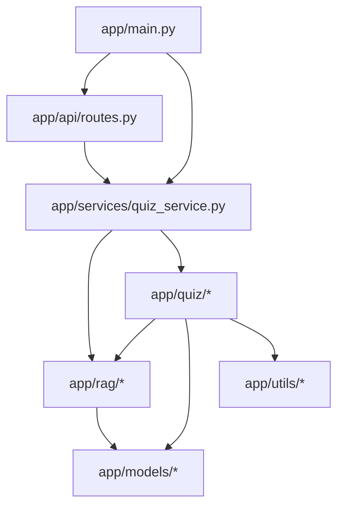

# Dependency Map

This document outlines the dependencies and architectural relationships between modules in the StudyBot application.

## 1. Module Dependency Graph (High Level)

The application follows a layered architectural approach:

## 2. Dependency Relationships

| Module | Primary Dependencies |
| :--- | :--- |
| `app/main.py` | `app/api/routes.py`, `app/services/quiz_service.py`, `app/rag/metadata_loader.py`, `app/quiz/quiz_generator.py` |
| `app/api/routes.py` | `app/models/api_schema.py`, `app/services/quiz_service.py` |
| `app/services/quiz_service.py` | `app/rag/*`, `app/quiz/*`, `app/monitoring/*`, `app/config/*` |
| `app/quiz/quiz_generator.py` | `app/rag/fact_cache.py`, `app/rag/retriever.py`, `app/quiz/*` (multiple sub-modules) |
| `app/rag/*` | `app/models/fact_schema.py`, `app/utils/*` |

## 3. Core vs. Helper Modules

*   **Core Modules**:
    *   `app/services/quiz_service.py`: Orchestrates the quiz workflow.
    *   `app/quiz/quiz_generator.py`: Core logic for generating questions from facts.
    *   `app/rag/fact_extractor.py`, `app/rag/metadata_loader.py`: Data ingestion and processing.
*   **Helper Modules**:
    *   `app/models/*`: Data structures/schemas.
    *   `app/utils/*`: General-purpose utilities (string cleaning, profiling).
    *   `app/monitoring/*`: Metrics and performance logging.

## 4. Circular Dependency Risks

The `app/quiz` directory contains many sub-modules that heavily inter-import.
*   *Risk*: High coupling in `app/quiz` (e.g., `quiz_generator.py` importing almost everything else) increases the risk of circular dependencies as the project scales.

## 5. Duplicate Responsibilities

*   Responsibility for logging seems split between specialized logging modules and `validation_logger.py`.
*   Fact parsing/cleaning logic appears in both `fact_cleaner.py` and potentially embedded within `fact_extractor.py`.

## 6. Potential Dead Modules

*   Files in `app/rag/` that start with `test_` (e.g., `test_cache.py`, `test_extractor.py`) should be verified to ensure they aren't part of the active import chain if they are meant to be strictly tests.

## 7. High-Risk Files (Modify with Caution)

*   `app/services/quiz_service.py`: Central orchestrator.
*   `app/quiz/quiz_generator.py`: Central hub for all quiz logic.
*   `app/rag/fact_extractor.py`: Foundation of knowledge ingestion.
*   `app/models/fact_schema.py` / `question_schema.py`: Changes here have cascading effects across the entire pipeline.
